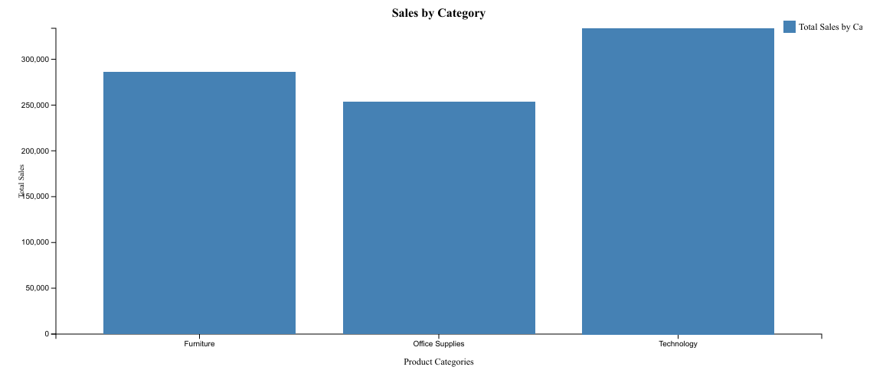
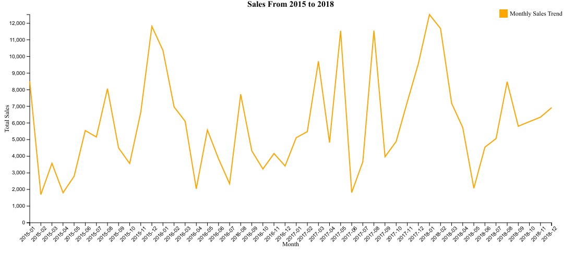

### **Overview**
The starter code for this assignment consists of two divs on the index.html page. 
Each div will be appended with an SVG for a different plot. 
The first plot is a bar chart that displays total sales across different product categories, using the "Category" and "Sales" columns 
from the dataset. The second plot is a line chart that visualizes monthly sales trends for a selected category, using the "Order Date" 
and "Sales" columns. These two charts are dynamically linked, allowing users to interact with the bar chart to update the line chart. 
Clicking on a bar in the bar chart will filter the line chart to display only the monthly sales trend for the selected category.

The assignment also includes adding interactive feedback, such as changing the color of the selected bar and displaying tooltips for 
enhanced readability.

### **Data Description**

The data used for this visualization was processed from the `train.csv` file. The preprocessing script, `data_preprocessing.py`, 
aggregates and formats the data into two separate CSV files for the required visualizations:

1. **`bar_chart_data.csv`**:
   - Generated by grouping data from `train.csv` based on product categories.
   - **Columns**:
     - **Category**: Represents the product categories (e.g., Furniture, Technology, Office Supplies).
     - **Sales**: Total sales for each product category.

2. **`line_chart_data.csv`**:
   - Created by summarizing monthly sales trends for each category.
   - **Columns**:
     - **Category**: Represents the product categories (e.g., Furniture, Technology, Office Supplies).
     - **Month**: Extracted from the "Order Date" column to represent the month of the order.
     - **Sales**: Total sales for the corresponding category and month.

The preprocessing script (`data_preprocessing.py`) performs tasks such as grouping, aggregating, and formatting the data to ensure it is 
ready for visualization. You can review or modify the script to handle similar datasets.

### **To Complete the Assignment**
Clone the starter code: Download the starter code and open the index.html file in a local server.

Create the JavaScript code: Use the provided /js/main.js file to implement the visualizations. 
Avoid writing JavaScript directly in the index.html file.

Commit and push your code: Once completed, commit and push your modified code to the repository to submit the assignment.

Steps
Step 1: Processing the Data
Before creating the visualizations, ensure the data is processed and formatted correctly. Use a script to:

Aggregate total sales for each product category to generate the bar chart data.
Summarize monthly sales trends for each category by grouping and filtering the line_chart_data.csv file.
You can use helper scripts or external tools to clean and merge the data as needed.

Step 2: Displaying the Bar Chart
When the page loads, the bar chart should be displayed in the first div (#bar-chart):

X-Axis: Represents product categories (e.g., Furniture, Technology, Office Supplies).
Y-Axis: Represents total sales for each category.
The bars should be interactive, changing color on selection and triggering an update in the line chart.
| 🔍 Hint: Make sure your dataset includes all categories and their total sales for the bar chart.

Step 3: Displaying the Line Chart
The second div (#line-chart) displays a line chart that dynamically updates based on the selected bar:

X-Axis: Represents months (e.g., Jan 2024, Feb 2024).
Y-Axis: Represents sales for the selected category.
By default, the line chart can display the sales trend for the first category in the dataset.
| 🔍 Hint: Update the line chart dynamically by filtering the dataset based on the selected category. 
Clear the previous chart before rendering the new one.

Step 4: Adding Interactive Feedback
Enhance the charts with the following interactive features:

Highlight Selected Bar:
Change the color of the clicked bar in the bar chart (e.g., red).

Step 5: Styling and Enhancements
Labels:
Add a title, x-axis label, and y-axis label to both charts.
Legend:
Include legends to indicate the meaning of the bars and lines.
Responsiveness:
Ensure the charts adjust to different screen sizes.

### **Grading**
This assignment is worth 10 points.
Each step is worth 2 points